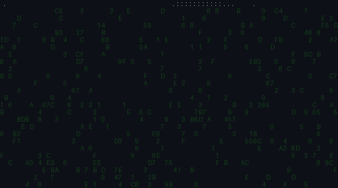

<table border="0" cellpadding="0" cellspacing="0" width="100%">
  <tr>
    <td width="40%" valign="top" align="center">
      
    </td>
    <td width="60%" valign="top">

```python
class PrathameshPandore:

    role = "AI Enthusiast"
    developer = "Full Stack Developer"
    education = "BCA Student"

    focus = [
        "Artificial Intelligence",
        "Machine Learning",
        "AI Applications"
    ]

    stack = [
        "Python", "React", "FastAPI", "SQL"
    ]

    goal = "AI Engineer"
```

    </td>
  </tr>
</table>

<br>

<div align="center">
  <h2>▶ Prathamesh Pandore</h2>
  <p>AI Enthusiast And Full Stack Developer Exploring Artificial Intelligence, Machine Learning And Modern Web Technologies.</p>
</div>

<br>

### 👤 Profile Information

<ul>
  <li>🎓 <b>BCA Student</b> At University Of Mysore</li>
  <li>💼 <b>AI Intern</b> At The Baap Company</li>
  <li>🤖 <b>Exploring</b> Artificial Intelligence And Machine Learning</li>
  <li>💻 <b>Building</b> AI Powered Applications</li>
  <li>🚀 <b>Full Stack</b> Development</li>
  <li>🎯 <b>Aspiring</b> AI Engineer</li>
</ul>

<br>

### 🛠 Tech Stack

<b>Languages</b>
<p>
  
</p>

<b>Frameworks</b>
<p>
  
</p>

<b>Tools & Databases</b>
<p>
  
</p>

<br>

### 🏆 Achievements

<p>
  
</p>

<br>

### 📊 GitHub Contributions

<div align="center">
  
</div>

<br>

### 📂 Popular Repositories

<table width="100%" border="0" cellpadding="0" cellspacing="0">
  <tr>
    <td width="50%" valign="top">
      <h4>🏥 ZVM Hospital</h4>
      <p><i>A robust hospital management interface.</i></p>
      <p><b>TypeScript • React</b></p>
      <p><a href="https://github.com/mrprathmeshpandore/zvm-hospital">View Repository</a></p>
    </td>
    <td width="50%" valign="top">
      <h4>💼 My Portfolio</h4>
      <p><i>Personal developer portfolio.</i></p>
      <p><b>TypeScript • Frontend Web</b></p>
      <p><a href="https://github.com/mrprathmeshpandore/My_Porfolio">View Repository</a></p>
    </td>
  </tr>
  <tr>
    <td width="50%" valign="top">
      <h4>📝 To-Do Management System</h4>
      <p><i>A smart task management application.</i></p>
      <p><b>HTML • CSS • JavaScript</b></p>
      <p><a href="https://github.com/mrprathmeshpandore/To-Do-Management-System">View Repository</a></p>
    </td>
    <td width="50%" valign="top">
      <h4>✅ To-Do List</h4>
      <p><i>A lightweight task list app.</i></p>
      <p><b>Web Technologies</b></p>
      <p><a href="https://github.com/mrprathmeshpandore/To-Do-List">View Repository</a></p>
    </td>
  </tr>
</table>

<br>

### 📫 Connect

<p>
  <a href="https://github.com/mrprathmeshpandore">
    
  </a>
  <a href="mailto:prathmeshpandore@gmail.com">
    
  </a>
</p>
